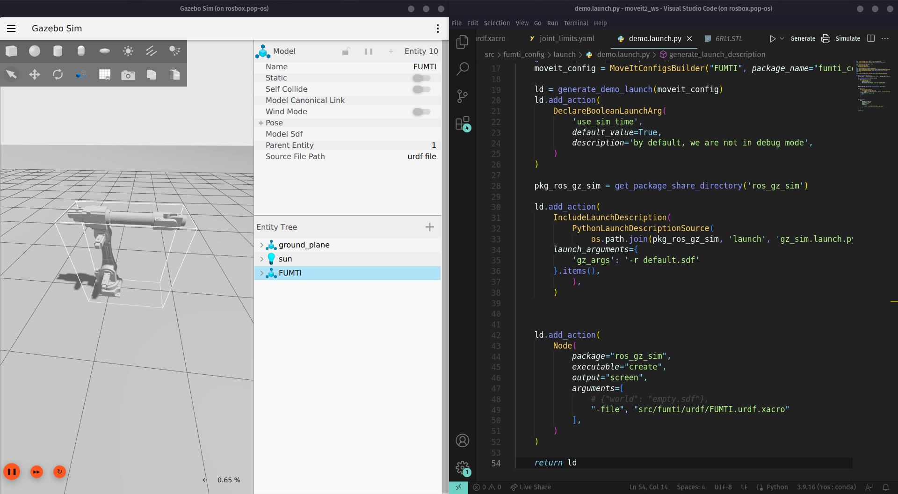

# Lab5
----
package is available at [`FUMTI`](FUMTI)

## Exercise1
The launch file for demo has been modified and executed to run Gazebo:


## Exercise2
A new launch file is created to launch RviZ and Gazebo together and do desired actions:

<p align="center">
  
</p>

The Gazebo and Ros2 control tags are added to the urdf file. Finally, by planning the robot in Rviz, it can be seen that robot will also move in Gazebo simulation.

## Exercise3
by running the package from [previous lab](../lab4/README.md), the manipulator will move in the designed path:

<p align="center">
  
</p>

## Exercise4
In this exercise, the camera plugin is added to FUMTI manipulator, and to do so, a new joint is added to connect the last link to the new camera link. However, visualize and collision are not considered for this link and it is just representing the camera. 

The output of this camera is published on Gazebo topics which is converted to Ros2 topics using `ros_gz_bridge` as following:
``` bash
ros2 run ros_gz_bridge parameter_bridge /world/default/model/FUMTI/link/end/sensor/camera1/image@sensor_msgs/msg/Image@gz.msgs.Image
```

And finally, `rqt_image_view` is used to illustrate the camera view:
```bash
ros2 run rqt_image_view rqt_image_view /world/default/model/FUMTI/link/end/sensor/camera1/image
```

<p align="center">
  
</p>

## Exercise5
To save the output, a tag named `save` is added to the urdf file which saves the frames of camera in a folder. these frames are then converted to a gif using `ffmpeg` which is shown bellow:

<p align="center">
  
</p>